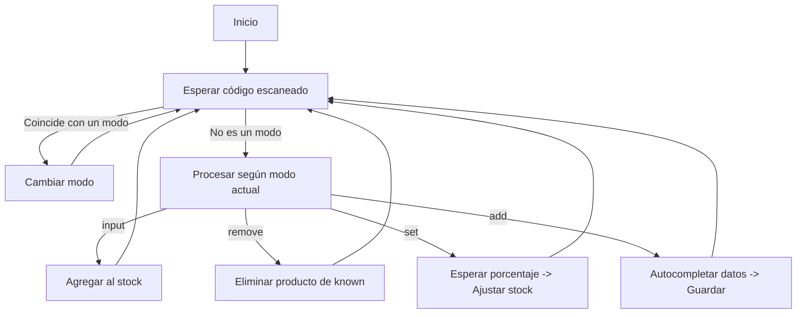
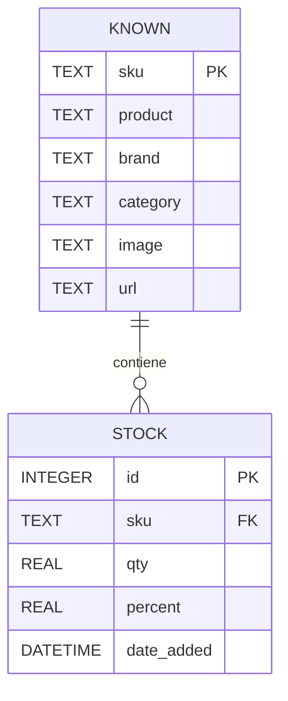

# 📦 HouseInventory

Sistema de gestión de inventario basado en códigos de barras, con soporte para lector de código de barras (pistola), entrada manual y funciones de scraping para autocompletar información de productos.

---

## 🚀 Características principales
- **Modos de operación**:  
  - `input`: ingreso de stock.
  - `remove`: eliminación de productos.
  - `set`: actualización de stock en porcentaje (incluye decimales).
  - `add`: edición y agregado de productos, con autocompletado vía scraper.
- **Compatibilidad con lector de código de barras** (escaneo directo).
- **Autocompletado** de datos de producto (nombre, marca, categoría, imagen, URL) si existe en la base local o en la web.
- **Subida de imagen** desde archivo en modo `add`.
- **Cambio de modo desde lector** incluso en medio de otros modos.
- **Registro de cambios** con logs detallados.
- **Interfaz gráfica** en Tkinter.
- **Persistencia** en bases SQLite (`known.db` y `stock.db`).

---

## 📂 Estructura de carpetas y archivos

```
HouseInventory
├── barcode_lib
│   ├── __init__.py
│   ├── gui.py              # Interfaz gráfica principal (Tkinter)
│   ├── logger.py           # Manejo de base de datos y operaciones de inventario
│   ├── main.py             # Punto de entrada del programa
│   ├── mappings.py         # Diccionario de modos y configuraciones
│   ├── scraper.py          # Funciones de scraping y autocompletado
│   └── utils.py            # Funciones auxiliares
├── data
│   ├── known.db            # Base de datos de productos conocidos
│   ├── stock.db            # Base de datos de inventario
│   └── config.json         # Configuración persistente del sistema
├── images                  # Carpeta para imágenes de productos
├── requirements.txt        # Dependencias del proyecto
└── README.md               # Este archivo
```

---

## 🖥️ Requisitos

- **Python** 3.8+
- Paquetes indicados en `requirements.txt`  
  Instalar con:
```bash
pip install -r requirements.txt
```

---

## ▶️ Ejecución

En la carpeta principal, ejecutar:
```bash
make
```
O bien:
```bash
python -m barcode_lib.main
```

---

## 📖 Manual de uso

### 1️⃣ Ingreso de stock (`input`)
- Escanear el **SKU** de un producto ya existente para sumarlo al stock.
- Si no existe, se debe usar el modo **add**.

### 2️⃣ Eliminación de productos (`remove`)
- Seleccionar un producto de la lista **known**.
- Pulsar el botón **Remove** o escanear el código correspondiente.
- El producto será eliminado de la base `known`.

### 3️⃣ Actualización en porcentaje (`set`)
- Escanear el **SKU** del producto.
- Escanear un valor de **porcentaje** (ej. `25%`).
- El último item ingresado de ese SKU se ajustará proporcionalmente.  
  Ejemplo: si había 5 gomas, `set` con `25%` dejará **4.25**.

### 4️⃣ Agregar/editar productos (`add`)
- Escanear o escribir el **SKU**.
- El sistema intentará autocompletar desde base local o web.
- Todos los campos son editables.
- La imagen se selecciona desde archivo.
- Guardar para registrar en `known` y opcionalmente agregar al stock.

---

## 🔄 Cambio de modo
- Puede hacerse mediante botón o escaneando un código que esté en `mappings.py`.
- Funciona incluso dentro de otros modos (`add` y `set`) interrumpiendo la acción actual.
- Ejemplo: si estás en `set` y escaneas un código de `input`, el sistema cambia inmediatamente.

---

## 📊 Diagramas de funcionamiento

### 📌 Diagrama de flujo de modos


---

### 🗄️ Diagrama de base de datos



---

## 🛠️ Notas adicionales
- Las imágenes de productos deben guardarse en la carpeta `images/`.
- El sistema maneja **decimales** en el stock para ajustes de porcentaje.
- El log de acciones se almacena en el sistema para referencia y auditoría.
- El scraper utiliza métodos locales y búsqueda web para autocompletar.

---

## 📌 Autor
Este sistema fue desarrollado para gestión rápida de inventarios con integración de lector de códigos de barras, priorizando **velocidad**, **precisión** y **flexibilidad**.

